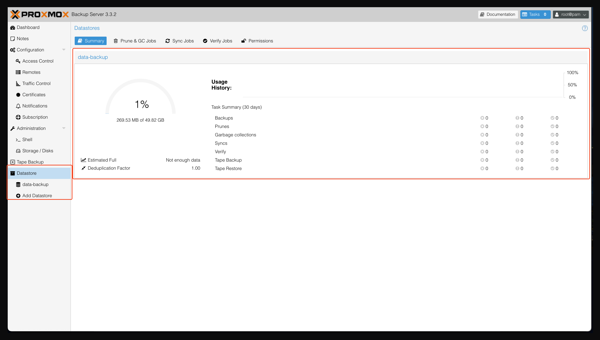
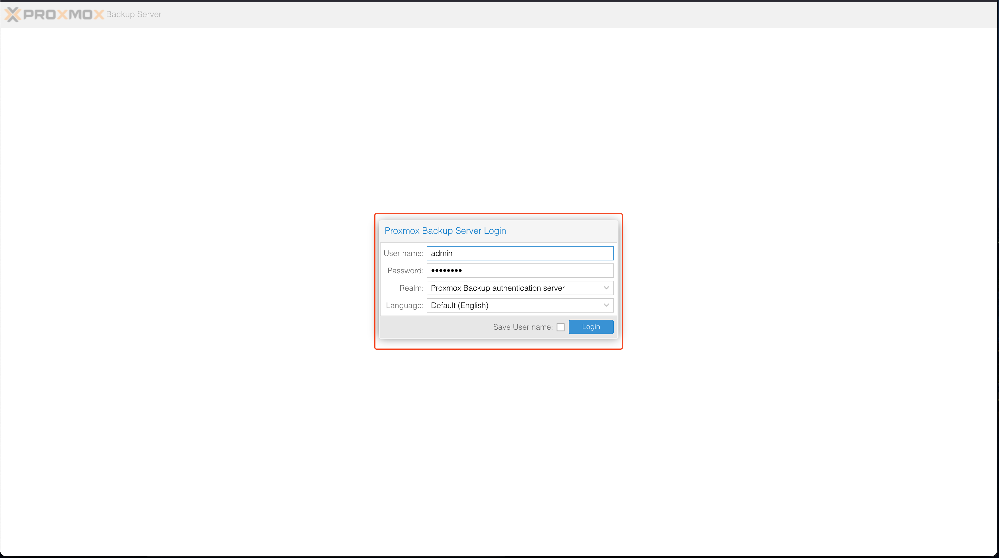
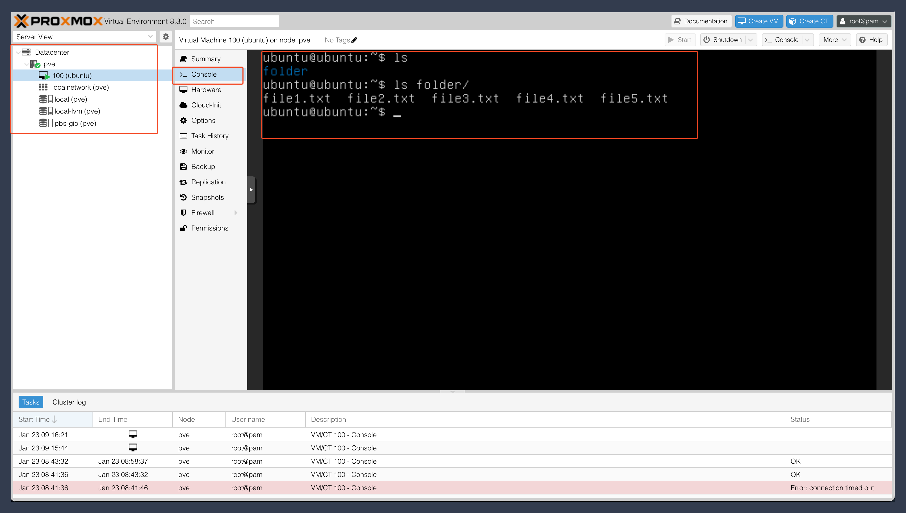

# biznetgio-workshop-pbs
Documentation Lab Biznetgio PBS Workshop

## Preparation Server
Access to VM Debian via ssh for linux os host
```
ssh -l debian 103.x.x.x -i name-xxx.key
```

Access to VM Debian via putty/mobaxterm for windows os host
```
https://kb.biznetgio.com/id_ID/informasi/cara-akses-instance-neo-cloud-melalui-putty
```

login as super user
```
sudo su
```

set hostname
```
hostnamectl set-hostname pbs-xxx
```

set timezone
```
timedatectl set-timezone Asia/Jakarta
```

Update and Upgrade package
```
apt update -y && apt upgrade -y
```

Create credentials for login debian
```
passwd debian
```

## Installation Proxmox Backup Server
login as super user
```
sudo su
```

Create debian package repository 
```
nano /etc/apt/sources.list.d/pbs-server.list
```

/etc/apt/sources.list.d/pbs-server.list
```
# debian 12 package
deb http://deb.debian.org/debian bookworm main contrib
deb http://deb.debian.org/debian bookworm-updates main contrib

# Proxmox Backup Server pbs-no-subscription repository provided by proxmox.com,
deb http://download.proxmox.com/debian/pbs bookworm pbs-no-subscription

# security updates
deb http://security.debian.org/debian-security bookworm-security main contrib
```

Install key
```
wget https://enterprise.proxmox.com/debian/proxmox-release-bookworm.gpg -O /etc/apt/trusted.gpg.d/proxmox-release-bookworm.gpg
```

Update repository
```
apt update
```

Update debian 12
```
apt upgrade
```

Install package proxmox-backup-server
```
apt install proxmox-backup-server
```

Check service proxmox-backup
```
systemctl status proxmox-backup
```

Check listen port proxmox-backup
```
ss -tulpn
```

Create password for root user
```
passwd root
```

Restart VM
```
reboot
```

Access from browser to pbs
```
https://103.x.x.x:8007
```

Proxmox Backup Server Dashboard


## Proxmox Backup Server Administration

### Disk Management
Disk Management Menu


Create Datastore


Verify Datastore


Create Backup Namespace


### User Management
User Management Menu


Create User Configuration


Create Access Control to User


Verify login with new user


## Proxmox VE Integration
### Integration
Login PVE


PVE dashboard


Add new storage with Proxmox Backup Server type


Fill the credentials to Proxmox Backup Server login


Check storage


### Test Backup 1
Access to VM on PVE


Create sample folder and file


Test Backup Scenario


Verify Backup Status


Verify Backup


Verify Backup Content


Verify usage datastore


### Test Backup 2
Access to VM on PVE


Test create 2gb file size


Test Backup Scenario


Verify Backup Status


Verify Backup


Verify Backup Content


Verify usage datastore


### Test Restore
Access to VM on PVE


Delete sample folder and file


Shutdown/Stop VM


Test restore Scenario


Restore completed


Verify VM


### Set schedule backup
Add new schedule backup


## Proxmox Backup Server Maintenance
Prune and GC Menu


### Prunning
Set prune jobs


### Garbage Collect
Set garbage collect schedule

